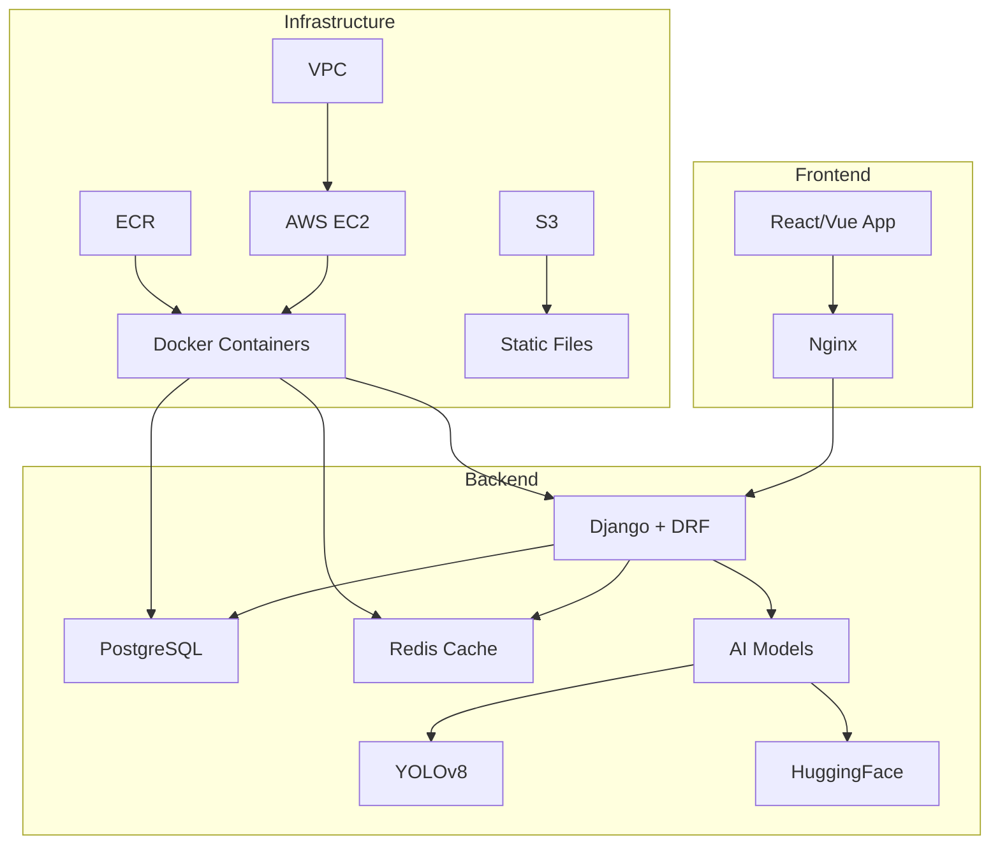
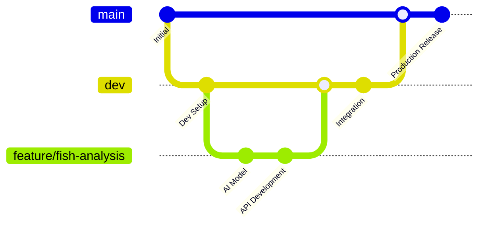
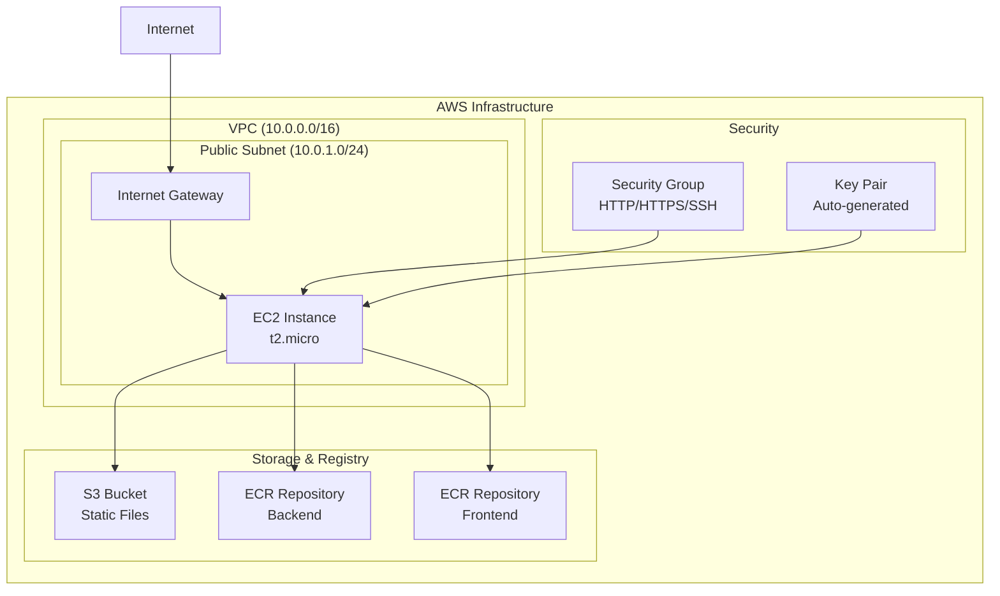

# 🐟 Team-PICK-O: AI 기반 생선 상태 분석 시스템

## 📋 프로젝트 개요

**Team-PICK-O**는 광어(넙치) 사진을 AI로 분석하여 건강 상태와 질병을 진단하는 시스템입니다.

### 🎯 핵심 기능
- **YOLOv8 기반 생선 객체 탐지**
- **HuggingFace 모델을 통한 종류 분류**
- **AIHub 넙치 질병 데이터셋 기반 질병 진단**
- **실시간 건강도 평가 및 치료 권장사항 제공**
- **Django Admin 패널을 통한 종합 관리**

---

## 🏗️ 시스템 아키텍처



### 📁 프로젝트 구조

```
Team-PICK-O/
├── backend/                    # Django 백엔드 API
│   ├── config/                # Django 프로젝트 설정
│   ├── fish_analysis/         # 생선 분석 메인 앱
│   ├── accounts/              # 사용자 관리
│   ├── dashboard/             # 관리 대시보드
│   └── requirements.txt       # Python 의존성
├── frontend/                   # 프론트엔드 (추후 구현)
├── infra/                     # Terraform 인프라 코드
│   ├── main.tf               # 메인 인프라 정의
│   ├── variables.tf          # 변수 정의
│   └── outputs.tf            # 출력값 정의
├── deployment/               # 배포 설정
│   ├── docker-compose.yml    # 프로덕션 환경
│   ├── docker-compose.dev.yml # 개발 환경
│   └── nginx.conf           # Nginx 설정
└── .github/workflows/        # CI/CD 파이프라인
    ├── feature-ci.yml       # 피처 브랜치 CI
    ├── dev-ci.yml          # 개발 브랜치 CI
    └── main-cd.yml         # 메인 브랜치 CD
```

---

## 🔄 CI/CD 파이프라인 설계

### 📊 Git Flow 전략



### 🚀 브랜치별 파이프라인

#### **1. Feature Branch CI** (`feature/*`)
```yaml
# .github/workflows/feature-ci.yml
트리거: feature/* 브랜치 Push/PR
작업:
  ✅ 코드 품질 검사 (선택적)
  ⚠️ 테스트 부재 시 경고만 출력
  🔍 보안 스캔
  📝 코드 리뷰 준비
```

#### **2. Development CI** (`dev`)
```yaml  
# .github/workflows/dev-ci.yml
트리거: dev 브랜치 Push
작업:
  ✅ 통합 테스트 (선택적)
  🐳 Docker 이미지 빌드 테스트
  📊 코드 커버리지 체크
  🔗 의존성 보안 검사
```

#### **3. Production CD** (`main`)
```yaml
# .github/workflows/main-cd.yml  
트리거: main 브랜치 Push
작업:
  🏗️ Docker 이미지 빌드 & ECR 푸시
  🚀 AWS EC2 배포
  🎛️ 환경변수 자동 설정
  ⏰ 1시간 후 자동 종료 (데모용)
  🔄 실패 시 자동 롤백
```

### 🔧 CI/CD 주요 특징

#### **효율성 최적화**
- **조건부 실행**: 테스트 파일 존재 여부 확인 후 환경 설정
- **병렬 처리**: Docker 빌드와 보안 검사 동시 실행
- **캐시 활용**: 의존성 및 Docker 레이어 캐싱

#### **보안 강화**
- **GitHub Secrets 관리**: 모든 민감 정보 암호화 저장
- **IAM 역할 기반 접근**: 최소 권한 원칙 적용
- **VPC 격리**: 네트워크 레벨 보안

#### **모니터링 & 알림**
- **실시간 배포 상태 알림**
- **상세한 로그 기록**
- **배포 실패 시 자동 알림**

---

## ☁️ AWS 인프라 설계 (Terraform)

### 🏛️ 인프라 구성도



### 📋 리소스 상세

#### **네트워크 인프라**
```hcl
# VPC 및 네트워킹
- VPC: 10.0.0.0/16
- Public Subnet: 10.0.1.0/24  
- Internet Gateway: 외부 접근
- Route Table: 퍼블릭 라우팅
```

#### **컴퓨팅 리소스**
```hcl
# EC2 인스턴스
- Type: t2.micro (프리티어)
- OS: Amazon Linux 2
- Storage: 20GB GP3 (암호화)
- Auto-scaling: 비활성화 (데모용)
```

#### **보안 설정**
```hcl
# Security Group Rules
- SSH (22): 관리자 접근
- HTTP (80): 웹 서비스
- HTTPS (443): SSL 지원
- Backend (8000): API 서버
- Frontend (3000): React 개발서버
```

#### **저장소 & 레지스트리**
```hcl
# Container Registry
- ECR Backend: team-pick-o-backend
- ECR Frontend: team-pick-o-frontend
- Lifecycle Policy: 10개 이미지 유지

# Object Storage  
- S3 Bucket: 정적 파일 저장
- Versioning: 활성화
- Public Access: 차단
```

### 🔐 보안 기능

#### **자동 키 관리**
```hcl
# TLS 키 페어 자동 생성
resource "tls_private_key" "ec2_key" {
  algorithm = "RSA"
  rsa_bits  = 4096
}

# 로컬 파일로 자동 저장 (권한 600)
resource "local_file" "private_key" {
  content         = tls_private_key.ec2_key.private_key_pem
  filename        = "${path.module}/${var.key_pair_name}.pem"
  file_permission = "0600"
}
```

#### **IAM 권한 최소화**
- ECR 읽기/쓰기 권한만 부여
- S3 특정 버킷만 접근 허용
- EC2 인스턴스 역할 기반 인증

---

## 🐳 Docker 컨테이너 설계

### 🔧 개발 환경 (`docker-compose.dev.yml`)

```yaml
# 개발자 로컬 환경용
services:
  database:           # PostgreSQL DB만 제공
    image: postgres:15-alpine
    environment:
      POSTGRES_PASSWORD: 12341234
    ports: ["5432:5432"]
  
  redis:              # Redis 캐시 (선택사항)
    image: redis:7-alpine
    ports: ["6379:6379"]

# Backend/Frontend는 로컬에서 직접 실행
# 장점: 빠른 개발, 디버깅 용이
```

### 🚀 프로덕션 환경 (`docker-compose.yml`)

```yaml
# AWS EC2 배포용 풀스택
services:
  frontend:           # React + Nginx
    image: ${FRONTEND_IMAGE}
    ports: ["3000:3000"]
    
  backend:            # Django + AI Models  
    image: ${BACKEND_IMAGE}
    ports: ["8000:8000"]
    environment:
      - DATABASE_URL=${DATABASE_URL}
      - SECRET_KEY=${SECRET_KEY}
      # ... 기타 환경변수
    
  database:           # PostgreSQL
    image: postgres:15-alpine
    environment:
      - POSTGRES_PASSWORD=${POSTGRES_PASSWORD}
    
  nginx:              # Reverse Proxy
    image: nginx:alpine
    ports: ["80:80", "443:443"]

# 환경변수는 GitHub Actions에서 자동 생성
```

### 🎛️ GitHub Actions 환경변수 제어

```yaml
# main-cd.yml에서 자동 생성
- name: Create deployment environment
  run: |
    cat > deployment.env << EOL
    BACKEND_IMAGE=$ECR_REGISTRY/${{ secrets.ECR_REPOSITORY_BACKEND }}:$IMAGE_TAG
    FRONTEND_IMAGE=$ECR_REGISTRY/${{ secrets.ECR_REPOSITORY_FRONTEND }}:$IMAGE_TAG
    DATABASE_URL="${{ secrets.DATABASE_URL }}"
    SECRET_KEY="${{ secrets.SECRET_KEY }}"
    # ... 기타 설정들
    EOL
    
    # EC2로 환경변수 파일 전송
    scp deployment.env $EC2_USER@$EC2_HOST:~/.env
    
    # Docker Compose 실행
    ssh $EC2_USER@$EC2_HOST 'docker-compose --env-file ~/.env up -d'
```

---

## 🔐 GitHub Secrets 설정 가이드

### 📋 필수 Secrets (16개)

#### **AWS 인프라 (4개)**
```bash
AWS_ACCESS_KEY_ID=AKIA...              # AWS IAM 액세스 키
AWS_SECRET_ACCESS_KEY=wJalr...          # AWS IAM 시크릿 키
AWS_REGION=ap-northeast-2               # AWS 리전 (서울)
AWS_S3_BUCKET_NAME=team-picko-bucket    # S3 버킷명
```

#### **Container Registry (2개)**
```bash
ECR_REPOSITORY_BACKEND=team-picko-backend    # Backend ECR 저장소
ECR_REPOSITORY_FRONTEND=team-picko-frontend  # Frontend ECR 저장소
```

#### **EC2 서버 (3개)**
```bash
EC2_HOST=1.2.3.4                       # EC2 퍼블릭 IP
EC2_USER=ec2-user                       # EC2 접속 사용자
EC2_PRIVATE_KEY=-----BEGIN RSA...       # SSH 접속용 PEM 키
```

#### **데이터베이스 (4개)**
```bash
DATABASE_URL=postgresql://user:pass@db:5432/teamPicko
POSTGRES_DB=teamPicko
POSTGRES_USER=teamPicko  
POSTGRES_PASSWORD=secure-password-here
```

#### **애플리케이션 (3개)**
```bash
SECRET_KEY=django-secret-key-here       # Django 비밀키
ALLOWED_HOSTS=your-domain.com,1.2.3.4   # 허용 호스트
REDIS_PASSWORD=redis-auth-password      # Redis 인증
```

### 🔧 Secrets 설정 방법

```bash
# GitHub Repository Settings → Secrets and variables → Actions
# "New repository secret" 버튼 클릭하여 각각 추가

# Terraform 실행 후 자동 출력된 값들 사용:
terraform output github_secrets
```

---

## 🚀 배포 프로세스

### 1️⃣ **인프라 구축**

```bash
# Terraform으로 AWS 인프라 생성
cd infra/
terraform init
terraform plan
terraform apply

# 출력된 정보를 GitHub Secrets에 등록
terraform output github_secrets
```

### 2️⃣ **환경 설정**

```bash
# 개발 환경 시작
cd deployment/
./dev-setup.sh start

# Backend 서버 실행
cd ../backend/
python manage.py migrate
python manage.py createsuperuser
python manage.py runserver
```

### 3️⃣ **배포 실행**

```bash
# 코드 푸시로 자동 배포
git checkout dev
git add .
git commit -m "feat: 새로운 기능 추가"
git push origin dev

# 프로덕션 배포
git checkout main
git merge dev
git push origin main  # 🚀 자동 배포 시작!
```

### 4️⃣ **모니터링**

```bash
# 배포 상태 확인
# GitHub Actions 탭에서 실시간 로그 확인

# 서비스 상태 확인  
curl -f http://EC2_IP/health
curl -f http://EC2_IP/api/v1/fish/model-status/

# 관리자 패널 접근
http://EC2_IP/admin/
```

---

## 📊 API 엔드포인트

### 🐟 생선 분석 API

```bash
# 단일 이미지 분석
POST /api/v1/fish/analyze/
Content-Type: multipart/form-data
Body: { "image": file, "analyze_species": true }

# 배치 분석
POST /api/v1/fish/batch-analyze/
Body: { "images": [file1, file2, ...] }

# 분석 결과 조회
GET /api/v1/fish/history/?days=30&health=diseased

# 건강 상태 요약
GET /api/v1/fish/health-summary/?user_id=1
```

### 📈 시스템 관리 API

```bash
# AI 모델 상태 확인
GET /api/v1/fish/model-status/

# 지원 파일 형식 조회
GET /api/v1/fish/supported-formats/

# 모델 초기화 (관리자 전용)
POST /api/v1/fish/initialize-models/
```

### 📚 API 문서

- **Swagger UI**: `http://localhost:8000/api/docs/`
- **ReDoc**: `http://localhost:8000/api/redoc/`
- **Django Admin**: `http://localhost:8000/admin/`

---

## 🛠️ 개발 환경 설정

### 🔧 Backend 개발

```bash
# 1. Python 환경 설정
python3.11 -m venv venv
source venv/bin/activate  # Windows: venv\Scripts\activate

# 2. 의존성 설치
pip install -r backend/requirements.txt

# 3. 환경변수 설정
cp backend/.env.example backend/.env
# .env 파일 수정

# 4. 데이터베이스 설정
cd deployment && ./dev-setup.sh start
cd ../backend
python manage.py migrate

# 5. 서버 실행
python manage.py runserver
```

### 🎨 Frontend 개발 (추후)
```bash
# React 앱 생성 예정
cd frontend/
npm install
npm start
```

---

## 🔍 트러블슈팅

### ❌ 일반적인 문제들

#### **Docker 이미지 빌드 실패**
```bash
# ECR 로그인 확인
aws ecr get-login-password --region ap-northeast-2

# 이미지 빌드 로그 확인
docker build --no-cache --progress=plain .
```

#### **EC2 접속 실패**
```bash
# SSH 키 권한 확인
chmod 600 infra/pick-o-key.pem

# 보안 그룹 확인
aws ec2 describe-security-groups --group-ids sg-xxx
```

#### **Django 마이그레이션 오류**
```bash
# 마이그레이션 리셋
python manage.py migrate --fake fish_analysis zero
python manage.py migrate fish_analysis
```

### 📞 지원 채널

- **GitHub Issues**: [프로젝트 이슈 트래커]
- **개발 문서**: `backend/README.md`
- **API 문서**: `http://localhost:8000/api/docs/`

---

## 👥 팀 협업 가이드

### 🔄 Git Workflow

```bash
# 1. 새 기능 시작
git checkout dev
git pull origin dev
git checkout -b feature/new-feature

# 2. 개발 및 커밋
git add .
git commit -m "feat(fish): 새로운 분석 기능 추가"

# 3. 개발 브랜치에 병합
git checkout dev  
git merge feature/new-feature
git push origin dev

# 4. 프로덕션 배포 (팀 리더만)
git checkout main
git merge dev
git push origin main
```

### 📝 커밋 메시지 규칙

```bash
feat(scope): 새로운 기능 추가
fix(scope): 버그 수정  
docs(scope): 문서 업데이트
style(scope): 코드 스타일 변경
refactor(scope): 코드 리팩토링
test(scope): 테스트 코드
chore(scope): 빌드/설정 변경
```

### 🎯 개발 우선순위

1. **Phase 1**: AI 모델 연동 및 분석 API 완성
2. **Phase 2**: 프론트엔드 웹 인터페이스 개발  
3. **Phase 3**: 모바일 앱 연동
4. **Phase 4**: 고도화 및 성능 최적화

---

## 📈 성능 최적화

### ⚡ 응답 속도 개선
- **AI 모델 캐싱**: 메모리에 모델 유지
- **이미지 전처리 최적화**: OpenCV 가속
- **데이터베이스 인덱스**: 조회 쿼리 최적화
- **Redis 캐싱**: 분석 결과 임시 저장

### 🔧 시스템 모니터링
- **Django Debug Toolbar**: 개발 환경 성능 분석
- **AWS CloudWatch**: 인프라 모니터링  
- **Application 로그**: 분석 성능 추적

---

## 🎯 향후 개발 계획

### 🔮 Phase 1 (현재)
- ✅ Django 백엔드 API 완성
- ✅ CI/CD 파이프라인 구축
- ✅ AWS 인프라 자동화
- 🔄 AI 모델 실제 연동

### 🚀 Phase 2 (다음)
- 📱 React 웹 인터페이스
- 🎨 사용자 친화적 UI/UX
- 📊 실시간 대시보드
- 🔐 사용자 인증 시스템

### 🌟 Phase 3 (미래)
- 📱 모바일 앱 (React Native)
- 🤖 AI 모델 성능 향상
- 📈 대용량 데이터 처리
- 🌐 다국어 지원

---

**🎉 Team-PICK-O 프로젝트에 오신 것을 환영합니다!**

이 문서는 살아있는 문서입니다. 프로젝트 진행에 따라 지속적으로 업데이트됩니다.

**마지막 업데이트**: 2024년 1월 15일  
**문서 버전**: v1.0.0  
**작성자**: Team-PICK-O Development Team