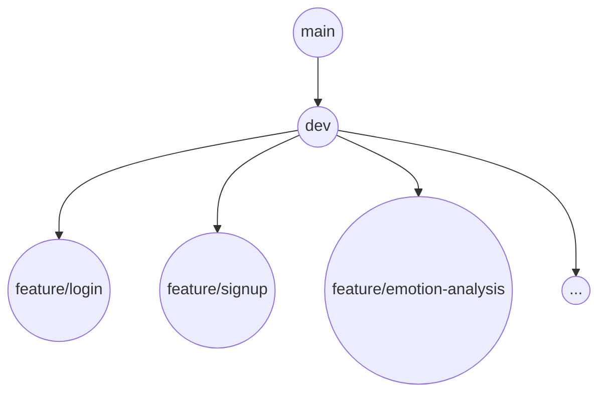

# Team-PICK-O

## Git 협업 플로우 (비배포 기준 로컬 개발 중심)

### 브랜치 구조



- **main**: 아직 배포 안함, 기준 브랜치 역할만
- **dev**: 통합 브랜치 (여러 기능이 병합되어 있음)
- **feature/**: 각 기능별 브랜치

---

### 브랜치 플로우 순서

1. **기능 개발 전 준비**
   ```bash
   git checkout dev
   git pull origin dev      # 최신 dev 기반
   git checkout -b feature/기능명
   ```
2. **기능 개발 및 커밋 (개발 후)**
   ```bash
   git add .
   git commit -m "feat: 로그인 기능 구현"
   git push origin feature/기능명
   ```
3. **통합 브랜치(dev)에 병합**
   ```bash
   git checkout dev
   git pull origin dev      # dev 최신화
   git merge feature/기능명
   git push origin dev
   ```
4. **다음 기능 시작할 때 다시 dev 기준으로**
   ```bash
   git checkout dev
   git pull origin dev
   git checkout -b feature/다음기능
   ```

---

## 커밋 메시지 규칙

### ✔ 형식

```
<태그>(<영향 범위>): <변경 요약>
```

- 제목은 **명령문**으로
- **짧고 명확하게**
- 영향 범위 여러 개면 `,`로 구분

### 🔖 기본 커밋 태그

| 태그      | 의미         | 예시                                   |
|-----------|--------------|----------------------------------------|
| feat      | 기능 추가    | feat(로그인): 소셜 로그인 추가         |
| fix       | 버그 수정    | fix(회원가입): 중복 아이디 오류 수정   |
| docs      | 문서 수정    | docs(Readme): 환경 변수 설정 추가      |
| style     | 코드 스타일  | style(프론트): 세미콜론 및 공백 정리   |
| refactor  | 리팩토링     | refactor(DB): 쿼리 최적화              |
| test      | 테스트 코드  | test(회원가입): 이메일 인증 테스트 추가|
| chore     | 설정 변경    | chore(Gradle): 종속성 업데이트         |
| perf      | 성능 개선    | perf(검색): 조회 속도 개선             |

### 🧩 추가 커밋 태그

| 태그     | 의미         | 예시                                   |
|----------|--------------|----------------------------------------|
| deploy   | 배포 관련    | deploy: 버전 1.0.1 배포                |
| ci       | CI/CD 설정   | ci(GitHub): 배포 스크립트 수정         |
| build    | 빌드 변경    | build(Gradle): Spring Boot 버전 업      |
| design   | UI 디자인    | design(로그인): 버튼 색상 변경         |
| rename   | 이름 변경    | rename(API): 컨트롤러 파일명 변경      |
| remove   | 파일 삭제    | remove(테스트): 사용되지 않는 코드 삭제|
| db       | DB 변경      | db(스키마): 전화번호 컬럼 추가         |

---

## ✅ 커밋 메시지 예시

```bash
feat(알림): 푸시 알림 기능 추가
fix(결제): 카드 결제 실패 버그 수정
docs(Readme): 설치 가이드 업데이트
refactor(결제): 중복 로직 제거
design(로그인): 버튼 색상 변경
build(Gradle): log4j 최신 버전 적용
```


